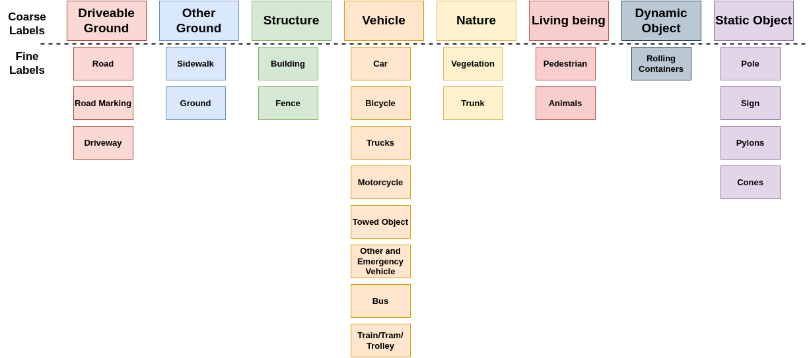

# PandaSet

Labels appearing in the illustration are fine labels, which are the labels used for inference by the dataset provider, which can slighlty differ from the labelisation found in the dataset. Unappearing labels are considered "Other".

