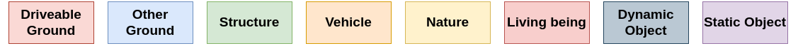

# CoarseLabel
Helper functions and illustrations of **COLA: COarse LAbel pre-training for 3D semantic segmentation of sparse LiDAR datasets**.

Each dataset folder present the following configuration:

- DatasetName
    - map_DatasetName_to_CL.py (can be launched to read (and optionnaly save) a frame for the target dataset with the coarse labels)
    - table_DatasetName_to_CL.py (map the original label of the target dataset to the coarse labels)
    - relabel_DatasetName_to_CL.py (relabel a full sequence of a dataset)

An example to save Coarse Labels from the frame 10 of the sequence 03 SemanticKITTI:

`python SemanticKITTI/map_SemanticKITTI_to_CL.py -f 10 -s 3 -d semanticKITTIDirectory --saved 1`

An other example to process the full sequence 03 of SemanticKITTI:

`python SemanticKITTI/relabel_SemanticKITTI_to_CL.py -s 3 -d semanticKITTIDirectory`

Link for the SRU-Net and SPVCNN pretrained model (with SemanticPOSS as the target): 
https://cloud.mines-paristech.fr/index.php/s/555t3DzzMmhA2xp

SRU-Net is the default model from : https://github.com/facebookresearch/PointContrast

SPVCNN is the default model from : https://github.com/mit-han-lab/spvnas

If you use the coarse labels please cite us:
@misc{sanchez2022cola,
      title={COLA: COarse LAbel pre-training for 3D semantic segmentation of sparse LiDAR datasets}, 
      author={Jules Sanchez and Jean-Emmanuel Deschaud and François Goulette},
      year={2022},
      eprint={2202.06884},
      archivePrefix={arXiv},
      primaryClass={cs.CV}
}

